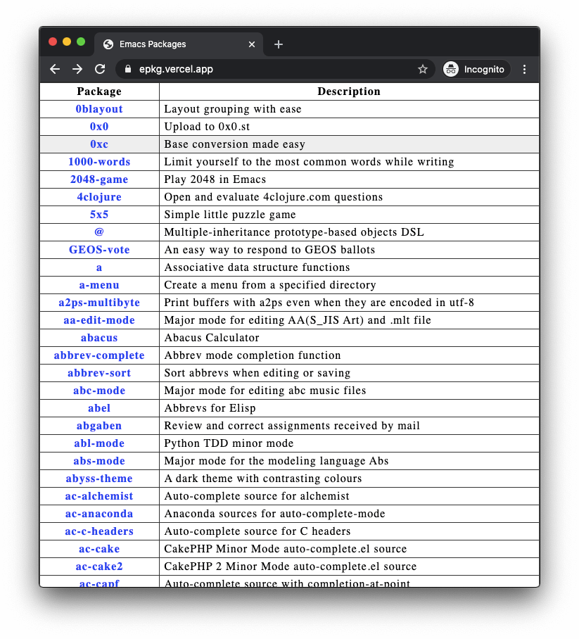
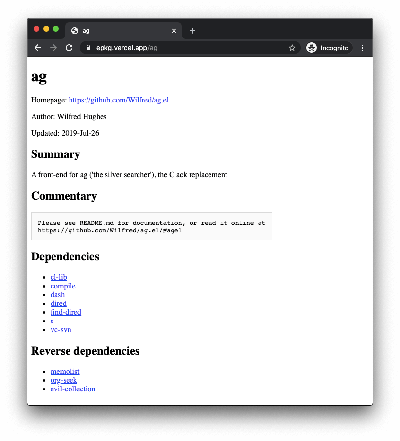

# A basic website for browse Emacs packages

These packages data is provided by the Emacsmirror package database:https://github.com/emacsmirror/epkgs

https://epkg.vercel.app/

https://epkg.vercel.app/ag/

## Build

The website is a static site.

- To build it, type `make`
- To preview it, type `cd public && python3 -m http.server`
